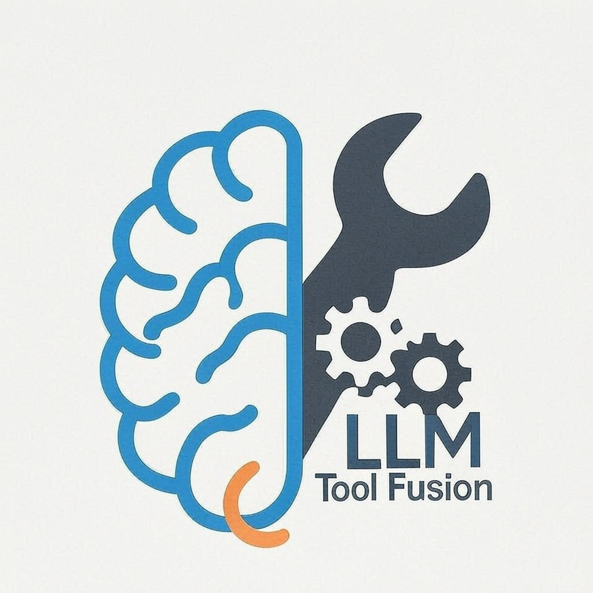

# llm-tool-fusion

<div align="center">
  
</div>

<div align="center">

[](https://www.python.org/downloads/)
[](LICENSE)
[](pyproject.toml)

</div>

## 📖 Read this documentation in [Portuguese](README.pt.md)

## 🇺🇸 English

### 📖 Description

**llm-tool-fusion** is a Python library that simplifies and unifies the definition and calling of tools for large language models (LLMs). Compatible with popular frameworks that support tool calling, such as Ollama, LangChain, and OpenAI, it allows you to easily integrate new functions and modules, making the development of advanced AI applications more agile and modular through function decorators.

### ✨ Key Features

- 🔧 **API Unification**: Single interface for different LLM frameworks
- 🚀 **Simplified Integration**: Add new tools with ease
- 🔗 **Wide Compatibility**: Support for Ollama, LangChain, OpenAI, and others
- 📦 **Modularity**: Modular architecture for scalable development
- ⚡ **Performance**: Optimized for production applications
- 📝 **Less Verbosity**: Simplified syntax for function declarations
- 🔄 **Automatic Processing**: Automatic execution of tool calls (optional)

### 🚀 Installation

```bash
pip install llm-tool-fusion
pipx install llm-tool-fusion
uv add llm-tool-fusion
poetry add llm-tool-fusion
```

### Preparing Your Functions

You must write your function docstrings using the Google style so that the decorators can extract the necessary information:

```python
"""
    Function description

    Args:
        argument (type): Description of the argument
    Returns:
        type: Description
"""
```

### 📋 Basic Usage (Example with OpenAI)

```python
from openai import OpenAI
from llm_tool_fusion import ToolCaller, FrameworkConstants

# Initialize OpenAI client and tool manager
client = OpenAI()
manager = ToolCaller(model="gpt-4.1", framework=FrameworkConstants.OPENAI)  # model is optional, framework defaults to OPENAI

# Define a tool using the decorator
@manager.tool
def calculate_price(price: float, discount: float) -> float:
    """
    Calculate final price with discount

    Args:
        price (float): Base price
        discount (float): Discount percentage
    Returns:
        float: Final price with discount
    """
    return price * (1 - discount / 100)

# Prepare message and make LLM call
messages = [
    {"role": "user", "content": "Calculate the final price of a $100 product with 20% discount"}
]

# First LLM call
response = client.chat.completions.create(
    model=manager.get_model(),  # or specify the model directly, e.g., "gpt-4.1"
    messages=messages,
    tools=manager.get_tools()
)

available_tools = manager.get_map_tools()
async_available_tools = manager.get_name_async_tools()

# Manual processing of tool calls
if response.choices[0].message.tool_calls:
    tool_results = []
    for tool_call in response.choices[0].message.tool_calls:
        if tool_call.function.name in available_tools:
            import json
            args = json.loads(tool_call.function.arguments)
            result = available_tools[tool_call.function.name](**args)
            tool_results.append(result)

print(tool_results)
```

### 🔄 Automatic Tool Call Processing

llm-tool-fusion provides a robust and simple system for processing tool calls automatically:

```python
# Function for LLM calls
llm_call_fn = lambda model, messages, tools: client.chat.completions.create(
    model=model, 
    messages=messages, 
    tools=tools
)

# Automatic tool call processing
final_response = manager.process_tool_calls(
    response=response,           # Initial response from the LLM
    messages=messages,           # Message history
    llm_call_fn=llm_call_fn,     # Function to call the LLM
)
```

#### 🎯 Main Parameters

- **`response`** (required): Initial response from the model
- **`messages`** (required): List of chat messages
- **`llm_call_fn`** (required): Function that calls the model

#### Why is `llm_call_fn` required?

It adds flexibility to the library, allowing you to use any LLM client or framework that supports tool calling. You define how the LLM is called, and the library handles the tool call logic.

#### ⚙️ Optional Parameters

You can customize the processing behavior using the `ProcessingConfig` class:

```python
from llm_tool_fusion import ToolCaller, FrameworkConstants, ProcessingConfig

configuration = ProcessingConfig(
    verbose=True,               # (optional) Detailed logs
    verbose_time=True,          # (optional) Time metrics
    clean_messages=True,        # (optional) Returns only message content
    use_async_poll=False,       # (optional) Execute async tools in parallel
    max_chained_calls=5         # (optional) Maximum chained calls
)

manager = ToolCaller(model="gpt-4.1", framework=FrameworkConstants.OPENAI, config=configuration)
```

- **`verbose`**: Shows detailed execution logs
- **`verbose_time`**: Shows execution time metrics
- **`clean_messages`**: Returns only the final message content
- **`use_async_poll`**: Executes async tools in parallel for better performance
- **`max_chained_calls`**: Limit of chained calls (default: 5)

#### ⚡ Performance with `use_async_poll`

When you have multiple asynchronous tools being called simultaneously, the `use_async_poll=True` parameter offers better performance:

```python
configuration = ProcessingConfig(
    use_async_poll=True
)
```

#### ✨ Main Features

- 🔁 **Automatic Loop**: Processes all tool calls to completion
- ⚡ **Asynchronous Support**: Runs synchronous and asynchronous tools automatically
- 📝 **Smart Logs**: Track execution with detailed logs and time metrics
- 🛡️ **Error Handling**: Robust error management during execution
- 💬 **Context Management**: Keeps conversation history organized
- 🔧 **Configurable**: Customize behavior to your needs

#### 🚀 Asynchronous Version

For applications that need asynchronous processing:

```python
#It uses asyncio.gather
configuration = ProcessingConfig(
    use_async_poll=True  # Recommended for better performance
)

manager = ToolCaller(model="gpt-4.1", framework=FrameworkConstants.OPENAI, config=configuration)

async_llm_call_fn = lambda model, messages, tools: client.chat.completions.create(
    model=model, 
    messages=messages, 
    tools=tools
)

final_response = await manager.process_tool_calls_async(
    response=response,
    messages=messages,
    llm_call_fn=async_llm_call_fn,
)
```

#### 🔧 Framework Support

The system works with different frameworks through the `framework` parameter in `ToolCaller`:

```python
# For OpenAI (default)
manager = ToolCaller(model="gpt-4.1")  # or framework=FrameworkConstants.OPENAI

# For Ollama
manager = ToolCaller(model="llama2", framework=FrameworkConstants.OLLAMA)
llm_call_fn = lambda model, messages, tools: ollama.Client().chat(
    model=model,
    messages=messages,
    tools=tools
)
```

### 🔧 Supported Frameworks

- **OpenAI** - Official API and GPT models
- **LangChain** - Complete framework for LLM applications
- **Ollama** - Local model execution
- **Anthropic Claude** - Anthropic's API
- **And many more...**

### 📄 License

This project is licensed under the MIT License - see the [LICENSE](LICENSE) file for details.

### ⚠️ Compatibility Notice

> **Note:** Tool declaration (functions and decorators) works with any LLM framework that supports tool calling. However, automatic tool call processing (`process_tool_calls` and `process_tool_calls_async`) has specific and optimized support only for some frameworks (such as OpenAI, Ollama, etc). For other frameworks, you may need to adapt the call function (`llm_call_fn`).

---

## 🛠️ Development

### Prerequisites

- Python >= 3.12
- We recommend using [UV](https://github.com/astral-sh/uv) for dependency management

### Setup Development Environment

```bash
# Clone the repository
git clone https://github.com/caua1503/llm-tool-fusion.git
cd llm-tool-fusion

# Install dependencies
uv venv
uv sync

# Run tests
python -m pytest
```

### Project Structure

```
llm-tool-fusion/
├── llm_tool_fusion/
│   └── __init__.py
|   └── _core.py
|   └── _utils.py
│      
├── tests/
├── examples/
├── pyproject.toml
└── README.md
```

---

**⭐ If this project was helpful to you, consider starring it on GitHub!**
